# Fintechproject1 - Interactive Retirement Dashboard
## An Investment Portfolio tool assisting people planing their retirement 

## Highlights

This interactive dashboard is a planning tool that allows users to have an access to historical data and various risk analysis for a range of stocks & cryptos (10 each type).  To get a result, users can simply select stocks/cryptos from dropdown and slide menu. We strove to make a friendly interface that was both informative and easy to use.

## Technologies, API resource and liburaries used
* Python - pandas, numpy 
* Pyviz - hvplot, plotly, panel
* Yfinance - this is a small Python library that will fetch LIVE data from Yahoo Finance service and return a neat dataframe for data manipulation.
* MCForecastTools(modified)


## Description
### Global Parameters
As a range of cryptos and stocks below tickers have been chosen for this project.  
Crypto:

"BTC-USD", "ETH-USD", "BNB-USD", "ADA-USD", "DOGE-USD", "XRP-USD", "LINK-USD" , "THETA-USD", "LTC-USD", "XLM-USD"

Stocks :

"AMZN", "TSLA", "NEO", "AAPL", "NVDA", "BABA", "NFLX", "DIS", "NKE", "SQ" 

Yfinance API allows access to most up-to-date data of global tickers available on their environment. Due to time constraint and a convenience to the users, we have limited the scope to 10 crypto/stock tickers. All the historical data has been retrived from Yfinance.

## Define functions

### Calculation of back dates 

* ```calc_3years_backdate()``` Calculated and defined 3 years worth of data from present date using python datetime & timedelta functions. 
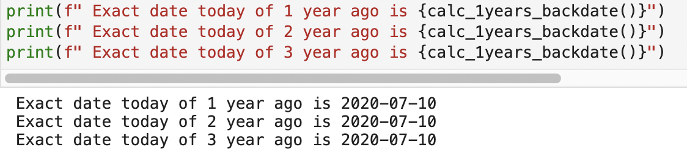


### Download crypto and stock data for 3 years
* ```download_cryptos_data()``` and ```download_stocks_data()``` Functions to draw crypto and stock data for 3 years from Yfinance package. All null data have been cleaned.
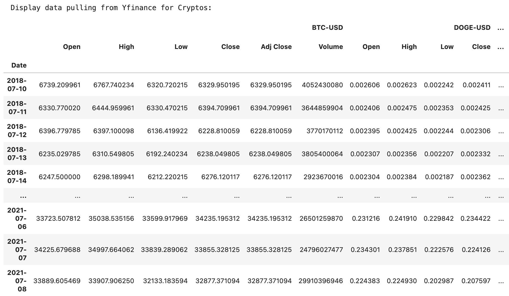

* Single crypto and stock data can be called using the Ticker as Index.

### Annual return function

* ```daily_return_data(df)``` This function returns a visual output of a single stock or crypto based on the historical data. BTC daily return:
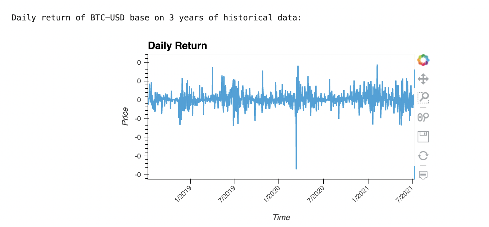

### Cumulative return function

* ```cumulative_return_plot(df)``` This function returns a visual output of cumulative returns of a single stock or crypto based on the historical data. \n Cumulative return of TSLA:
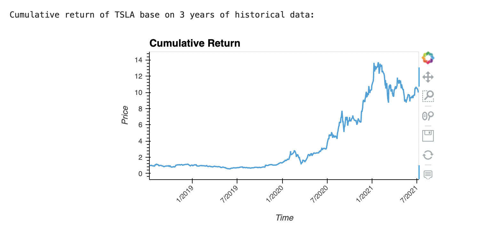

### Moving Average function

* ```MA_plot(df)``` This function returns a visual output of moving average (30, 60, 90 days) of a single Crypto or Stock based on the historical data. Moving average of BTC:
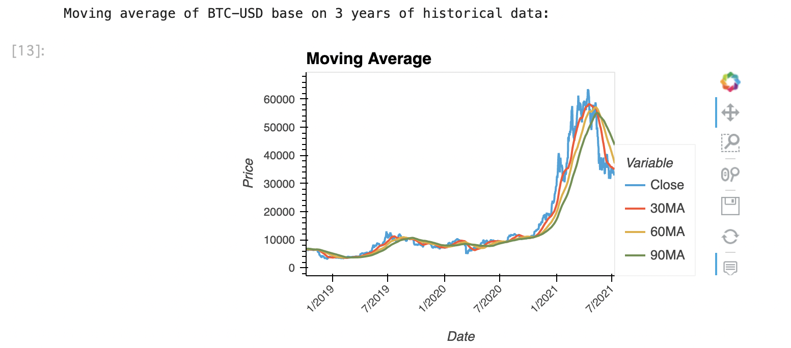


### Daily return function for multiple tickers

* ```daily_returns_multiple_tickers(df)``` This function return a dataframe of daily return base on original downloaded data from YFinance (crypto_df and stock_df) by:
1.  Calculate Daily return for all Open, High, Low, Close, Adj Close column for each asset
2.  Loop through each Level 0 column indexes (Stock/Crypto's Ticker) and ammend that to a new-dataframe 
3.  Return the new-dataframe

* annual_sharpe_ratio_plot(df)``` Daily return of each crypto:
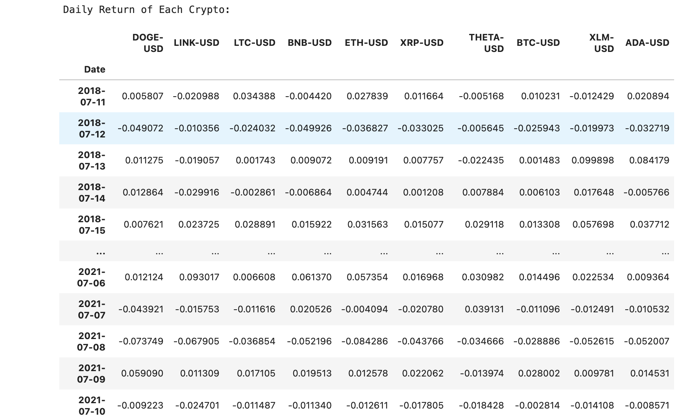


### sharpe ratio function

* ```annual_sharpe_ratio_plot(df)``` This function returns a visual output of Annual Sharpe Ratio of all crypto currencies or stocks based on the histrorical data.
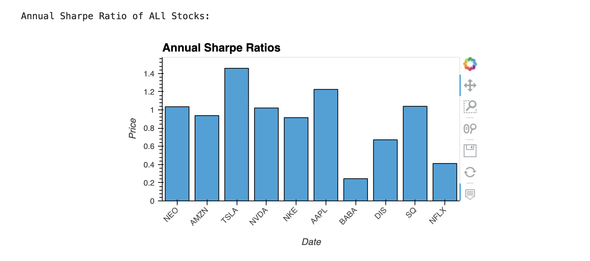

### Monte Carlo cumulative return into a dataframe function - Using a modified version of MCForcastTools.py specific to this project.

* ```mc_cumulative_return(df, num_sim, num_day)``` This function Calculate Monte Carlo cumulative of return of a Stock or Crypto Ticker and returns a dataframe.
 * This function take in parameters: 
 1. A dataframe containing historical data of any single asset.  
 2. The number of simulations.
 3. The number of days forecast into the future.
 
 * BTC Cumulative return of 10 simulations and 365 days in future:
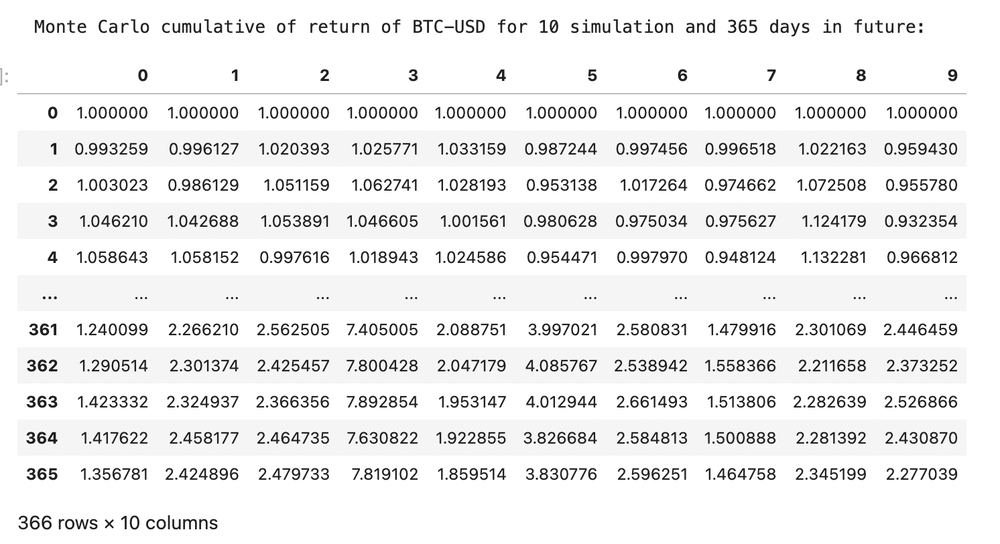

### Monte Carlo Simulation function

* ```mc_plot_cumulative(df, num_sim, num_day)``` This function provides a visual demonstration of the forcasted cumulative returns (line Chart) of a stock or crypto using a Monte Carlo simulation.
*  This function take in parameters: 
 1. A dataframe containing historical data of any single asset.  
 2. The number of simulations
 3. The number of days forecast into the future.

* BTC Monte Carlo cumulative return of 10 simulations and 365 days in future: 
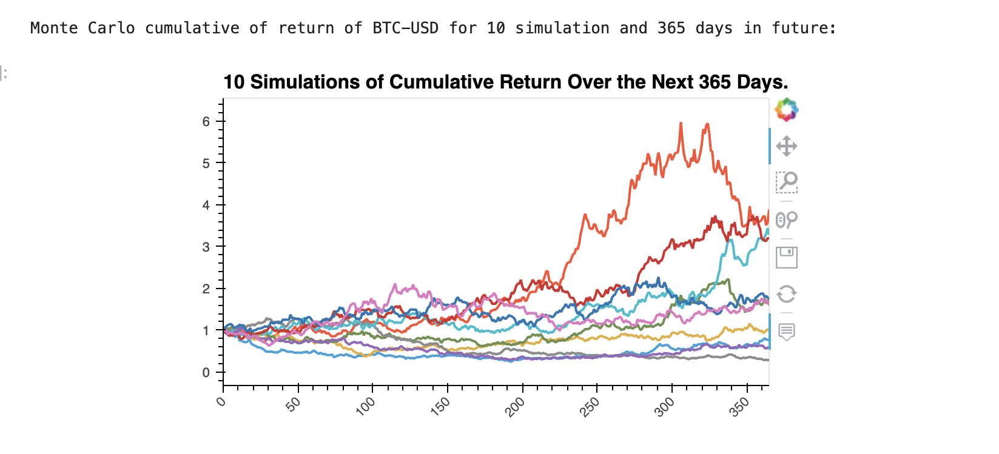

### Monte Carlo Simulation distribution function

 * ```mc_plot_distribution(df, num_sim, num_day)``` This function provides a visual demonstration of Monte Carlo Distribution of return of a Stock or Crypto Ticker and return a Bar Chart
 * This function take in parameters: 
 1. A dataframe containing historical data of any single asset.  
 2. The number of simulations
 3. The number of days forecast into the future.

* BTC Monte Carlo Distribution of return for 10 simulations and 365 days in future:
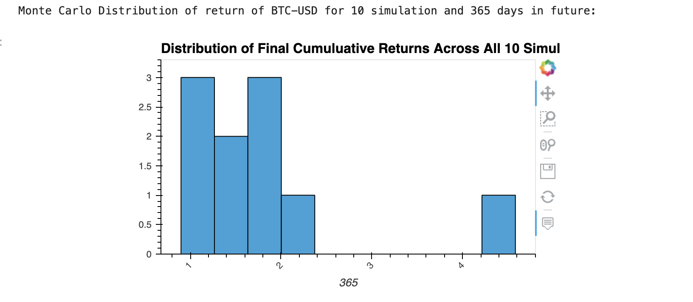

### Monte Carlo Simulation Statistic function

 * ```mc_summarize_statistic(df, num_sim, num_day, initial_investment)``` This function provides a statistical demonstration of Monte Carlo Distribution of return of a Stock or Crypto Ticker and return an estimation Message.
 * This function take in parameters: 
 1. A dataframe containing historical data of any single asset.  
 2. The number of simulations
 3. The number of days forecast into the future.

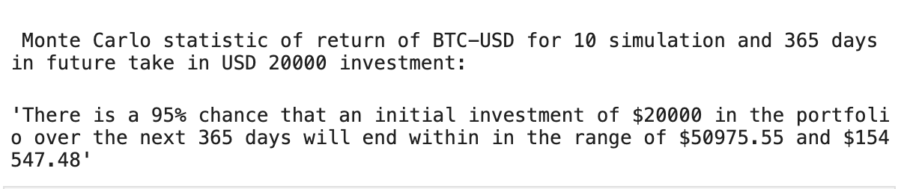

### Ploting beta taking in the Benchmark function

* ```calc_sp_benchmark()``` and ```calc_usdt_benchmark()``` These functions return a visual image of beta using a benchmark data retrived from the historical data of 'SP500' and 'USDT'.

1. SP500 & USDT data which has been cleaned and sorted to display the benchmark o daily returns.

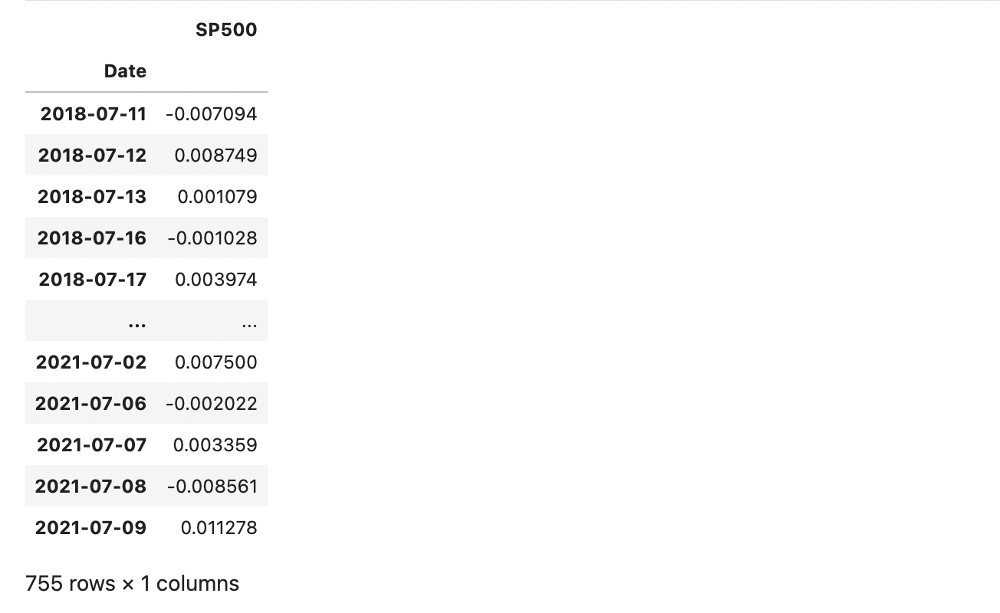

2. Joined benchmark data of SP500 to daily return of stock multiple tickers using 'Concat' method. 

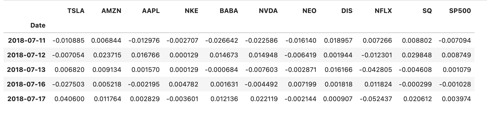

3. Joined benchmark data of USDT to daily return of crypto multiple tickers using 'Concat' method.

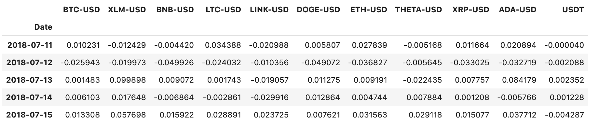

4. Calculate Beta taking in the benchmark function

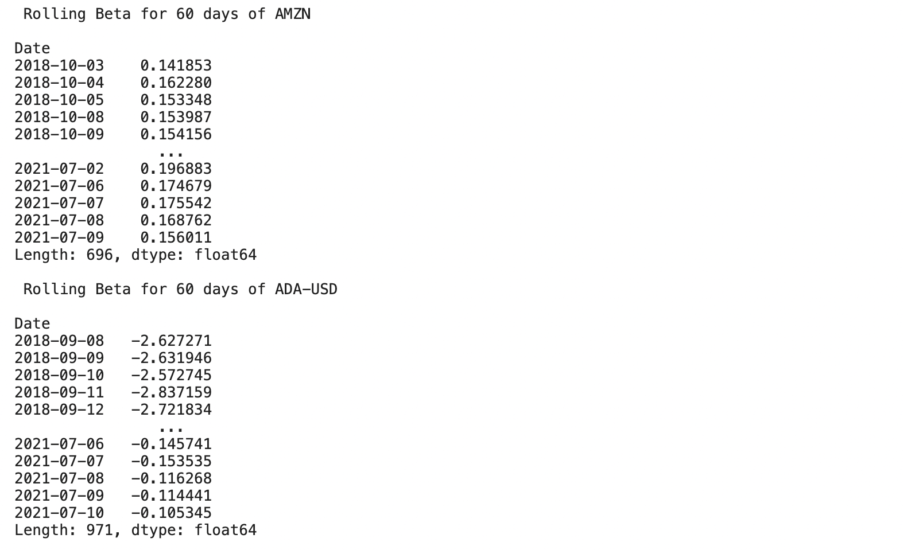

5. ```beta_stock(df, rolling)``` and ```beta_crypto(df, rolling)``` Ploting beta using the benchmark function 

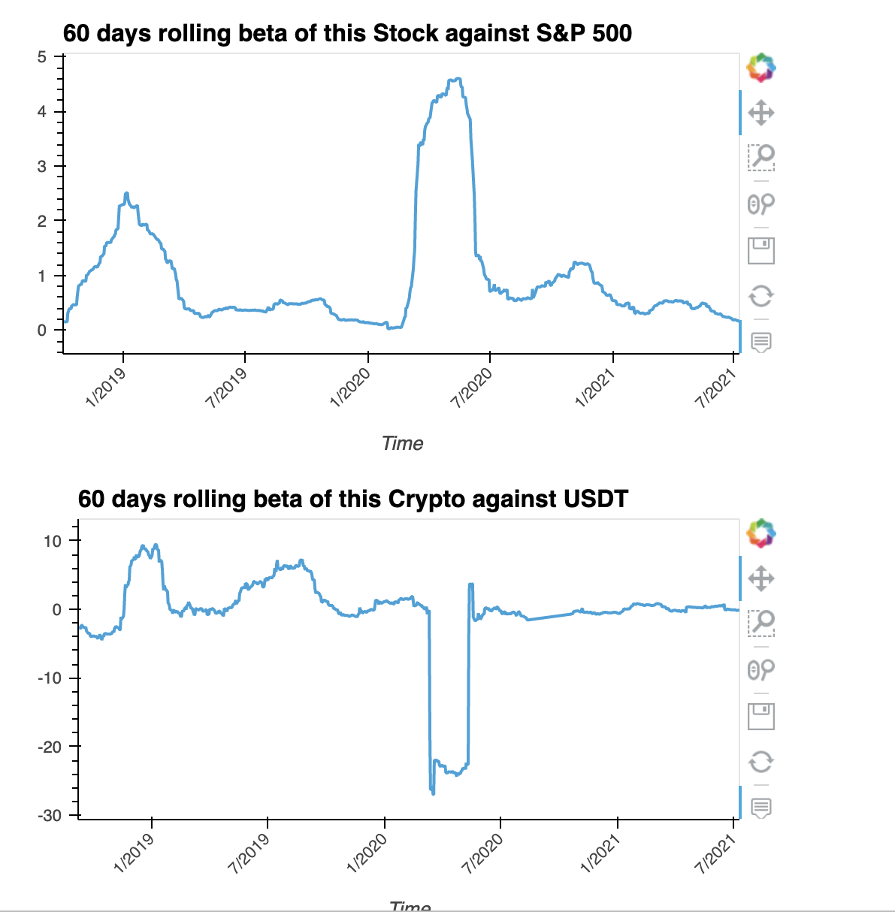

# Dashboard Presentation

The dashboard contains three tabs 'historical data', 'Risk Analysis', and 'MC Projection Analysis'. All dropdowns, sliders and inputs in this dashboard are **reactive** and the charts/visual represnattion will be update base on user selection of input

1. Fetch initial data
2. Set title and welcome text for the Dashboard
3. Create Widget Elements 
4. Crypto Historical Data
5. Stock Historical Data
6. Display Risk Analysis
7. Input for portfolio
8. Crypto Projection Data
9. Stock Projection Data
10. Display and layout for dashboard

## Investment Projection Dashboard

### Historical Data tab:
Users can select tickers and years to view moving average and cumulative returns data.

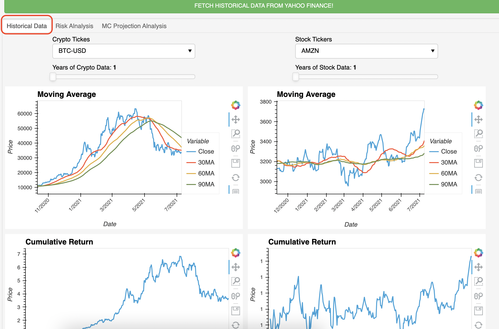

1. Select tickers from drop down menu.

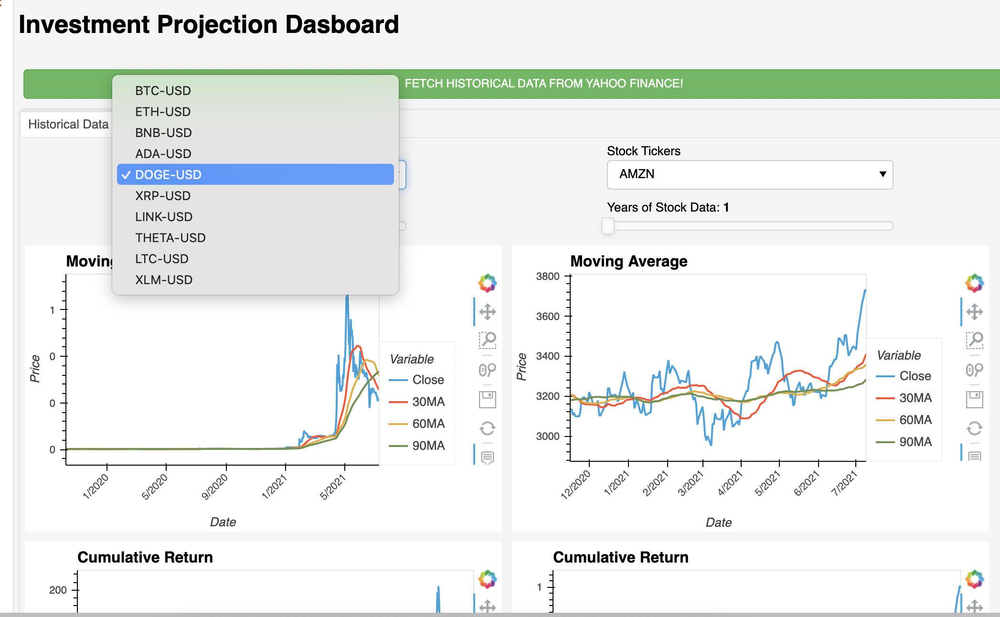

2. Slide bar to select years.

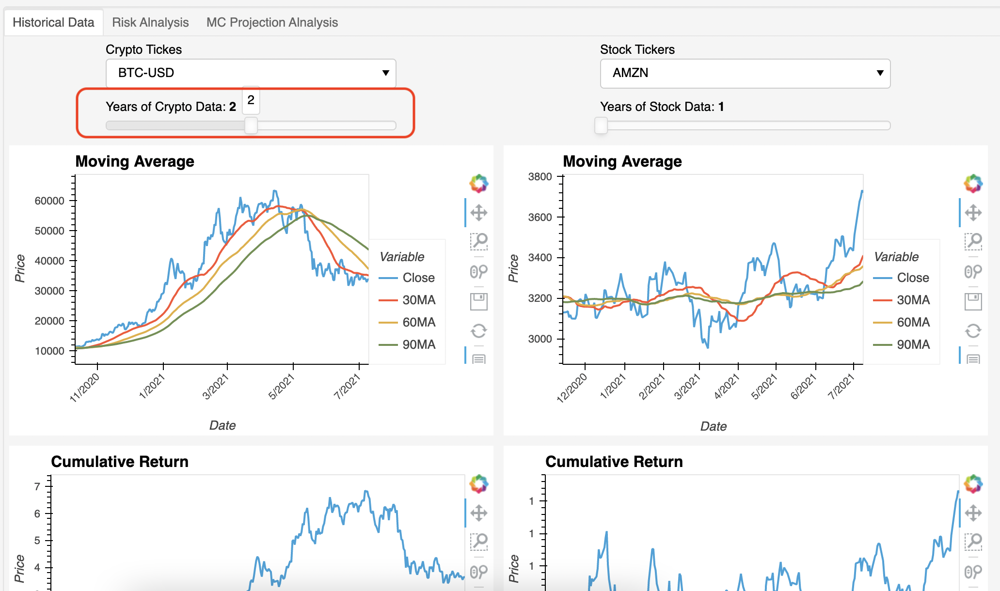

### Risk Analysis tab:
Users can view sharpe ratio and rolling beta from this tab.

1. The top half of the tab shows the sharpe ratio data of all available cryptos and stocks.

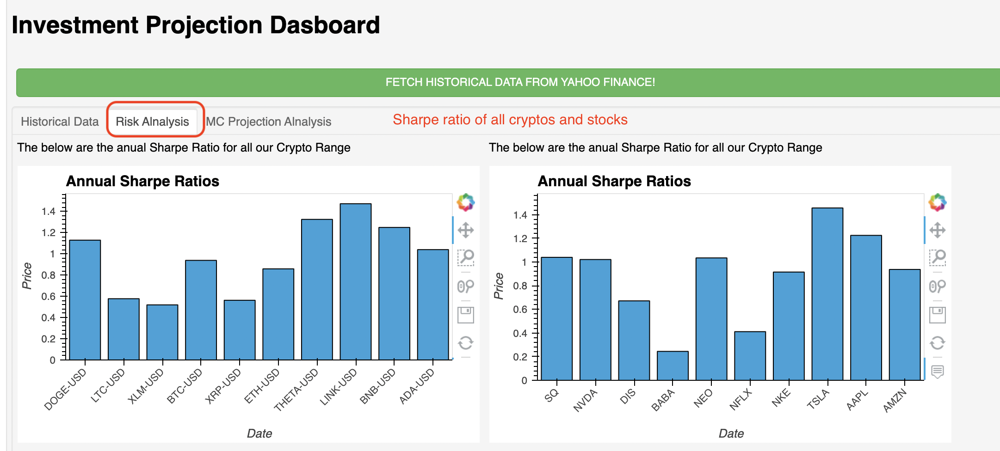

2. On the bottom half of the tab allows users to select and see the rolling beta of risk comparison against SP500 for stocks and USDT for cryptos.

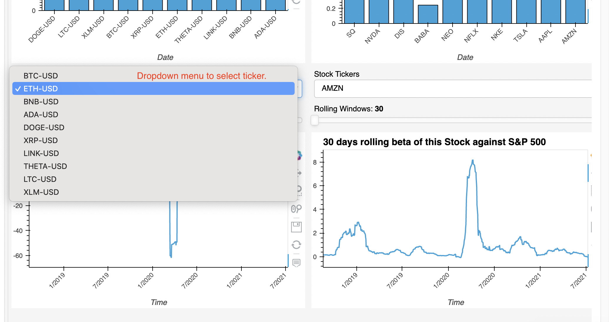

3. Rolling windows can be selected using the slide function.

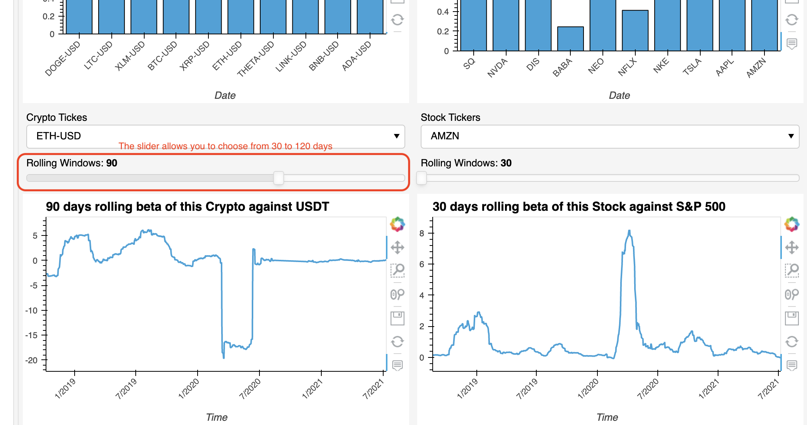

### MC Projection Analysis tab:

Users can view Monte Carlo projections from selecting tickers, number of simulations and number of days forcast into the future. By providing the initial investment amount manually it will automatically compute the result in writing. 

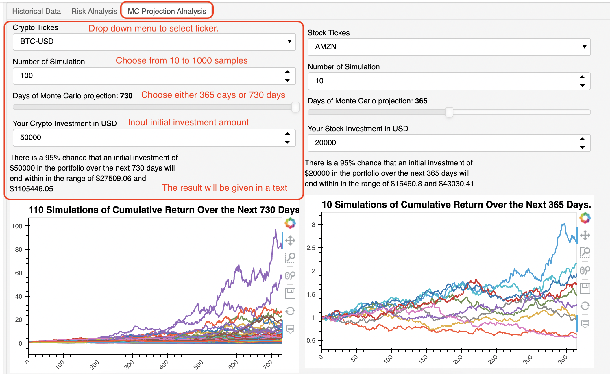

# Conclusion

Our purpose of this project was to build a dashboard that assists users make good investment decisions to plan for their retirement. 
The research and investigation behind choosing the right library to begin was a critical part of our project. While contemplating the contents of the historical data, we have initially aimed to use MPI finance as a library to display plots e.g. Volume and candle bars, however to get the best visual outcome, choosing pyviz hvplot was the right choice in staying consistant with our format. We have also looked through other API libraries such as Alpaca, Alternative Free Crypto API but found yfinance was the most straight forward and relaible source of information. With the Monte Carlo Simulation using the MC Forcast tool in which we modified to meet our requirements to display pvplot on the dashboard. Putting limitation to the scope of the samples from 10 to 100 to meet the best performance of a standard PC. 
The cleaning up of a yfinance data involved the use of complex for loops functions and took many hours to figure out to achieve the desired outcome. 
Overall the success of the project was accredited to planning and  the breaking-up of tasks at the start of the project to limit the scope and have a good understanding on what each member needs to bring to the table.
 

### Prerequisit 
yfinance library has been updated while we are working on the project. The new installation packeage as below and will be added to the import secion of our code.

!pip install yfinance --upgrade --no-cache-dir


### List of Contributors 
Tian, Luke, Alvin, Yohei