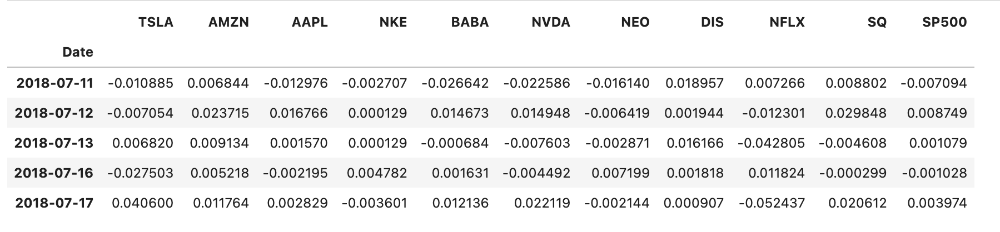

# Fintechproject1 - Interactive Retirement Dashboard
## An Investment Portfolio for people seeking an early retirement 

## Highlights

This interactive dashboard simulate an investment portfolio that allows users to have an access to historical data and various risk analysis of 10 stocks & cryptos.  To get a result, users can simply select stocks/cryptos from dropdown and slide menu. Friendly interface and so easy to use!

## Technologies, API resource and liburaries used
* Python - pandas, numpy 
* Pyviz - hvplot, plotly, panel
* Yfinance
* MCForecastTools(modified)

## Description
### Global Parameters
As a range of cryptos and stocks below tickers have been chosen for this project.  
Crypto:

"BTC-USD", "ETH-USD", "BNB-USD", "ADA-USD", "DOGE-USD", "XRP-USD", "LINK-USD" , "THETA-USD", "LTC-USD", "XLM-USD"

Stocks :

"AMZN", "TSLA", "NEO", "AAPL", "NVDA", "BABA", "NFLX", "DIS", "NKE", "SQ" 

Yfinance API allows access to most up-to-date data of global tickers available on their environment. Due to time constraint and a convenience to the users, we have limited the scope to 10 crypto/stock tickers. All the historical data have been retrived from Yfinance API.

## Define functions

### Calculation of back dates

* Calculated and defined 3 years back date using python datetime & timedelta functions. 

### Download crypto and stock data for 3 years
* Functions to draw crypto&stock data for 3 years from Yfinance package. All null data have been cleaned.

* Single crypto and stock data can be called using the Ticker as Index.

### Annual return function

* This function returns a visual output of a single stock or crypto based on the historical data. BTC daily return:

### Cumulative return function

* This function returns a visual output of cumulative return of a single stock or crypto based on the historical data. \n Cumulative return of TSLA:

### Moving Average function

* This function returns a visual output of moving average (30, 60, 90 days) of a single Cryptocurrency or Stock based on the historical data. Moving average of BTC:

### Daily return function for multiple tickers

* This function return a dataframe of daily return base on original downloaded data from YFinance (crypto_df and stock_df) by:
1.  Calculate Daily return for all Open, High, Low, Close, Adj Close column for each stock
2.  Loop through each Level 0 column indexes (Stock/Crypto's Ticker) and ammend that to a new-dataframe 
3.  Return the new-dataframe

* Daily return of each crypto:

### sharpe ratio function

* This function returns a visual output of Annual Sharpe Ratio of all crypto currencies or stocks based on the histrorical data.

### Monte Carlo cumulative return into a dataframe function - Using a modified version of MCForcastTools.py specific to this project.

* This function Calculate Monte Carlo cumulative of return of a Stock or Crypto Ticker and return dataframe.
 * This function take in parameters: 
 1. A dataframe of a single Crypto/Stock historical data  
 2. The number of simulations
 3. The number of days forecast in to future.
 
 * BTC Cumulative return of 10 simulations and 365 days in future:

### Monte Carlo Simulation function

* This function provides a visual demonstration of Monte Carlo cumulative of return of a Stock or Crypto Ticker and return a line chart
*  This function take in parameters: 
 1. A dataframe of a single Crypto/Stock historical data  
 2. The number of simulations
 3. The number of days forecast in to future.

* BTC Monte Carlo cumulative return of 10 simulations and 365 days in future: 

### Monte Carlo Simulation distribution function

 * This function provides a visual demonstration of Monte Carlo Distribution of return of a Stock or Crypto Ticker and return a Bar Chart
 * This function take in parameters: 
  1. A dataframe of a single Crypto/Stock historical data  
  2. The number of simulations
  3. The number of days forecast in to future

* BTC Monte Carlo Distribution of return for 10 simulations and 365 days in future:

### Monte Carlo Simulation Statistic function

 * This function provides a statistical demonstration of Monte Carlo Distribution of return of a Stock or Crypto Ticker and return an estimation Message.
 * This function take in parameters: 
  1. A dataframe of a single Crypto/Stock historical data  
  2. The number of simulations
  3. The number of days forecast in to future
  4. The amount of initial investment

### Ploting beta taking in the Benchmark function

* This function returns a visual image of beta using a benchmark data retrived from the historical data of 'SP500' and 'USDT'.

1. SP500 & USDT data which has been cleaned and sorted to display the benchmark o daily returns.

2. Joined benchmark data of SP500 to daily return of stock multiple tickers using 'Concat' method. 

3. Joined benchmark data of USDT to daily return of crypto multiple tickers using 'Concat' method.

4. Calculate Beta taking in the benchmark function

5. Ploting beta using the benchmark function 

# Dashboard Presentation

The dashboard contains three tabs 'historical data', 'Risk Analysis', and 'MC Projection Analysis'.

1. Fetch initial data
2. Set title and welcome text for the Dashboard
3. Create Widget Elements 
4. Crypto Historical Data
5. Stock Historical Data
6. Display Risk Analysis
7. Input for portfolio
8. Crypto Projection Data
9. Stock Projection Data
10. Display and layout for dashboard

## Investment Projection Dashboard

### Historical Data tab:
Users can select tickers and years to view moving average and cumulative returns data.

1. Select of tickers from drop down menu.

2. Slide bar to select years.

### Risk Analysis tab:
Users can view sharpe ratio and rolling beta from this tab.

1. The top half of the tab shows the sharpe ratio data of all available cryptos and stocks.

2. On the bottom half of the tab allows users to select and see the rolling beta of risk comparison against SP500 for stocks and USDT for cryptos.

3. Rolling windows can be selected using the slide function.

### MC Projection Analysis tab:

Users can view Monte Carlo projections from selecting tickers, number of simulations and number of days forcast into the future. By providing the initial investment amount manually it will automatically compute the result in writing. 

# Conclusion

Our purpose of this project was to build a dashboard that assist users make a good investment decision for their retirement. 
The research investigation and choosing the right liburary to begin with was a critical part of our project. While contemplating the contents of the historical data, we have initially aimed to use MPI finance as a liburary to display plots e.g. volume and candle bars, however to get the best visual outcome choosing pyviz hvplot was the right choice in staying consistant with our format. We have also looked through other API liburaries such as Alpaca, Alternative Free Crypto API but found yfinance was the most straight forward and relaible source of information. With the Monte Carlo Simulations, MC Forcast tool have been modified to meet our requirement to display pvplot on the dashboard. Putting limitation to the scope of the samples from 10 to 1000 to meet the best performance of standard PC. 
Cleaning up of a yfinance data involved a use of complex 'for loop' functions and took many hours to figure out the right outcome. 
Overall the success of the project was well planning and break-up of tasks at the start of the project to limit the scope and good understanding and commitment by each members to complete the tasks on time and working collaborately with each other. 
 

### Prerequisit 
yfinance liburary has been updated while we are working on the project. The new installation packeage as below.

!pip install yfinance --upgrade --no-cache-dir

### List of Contributors 
Tian, Luke, Alvin, Yohei
